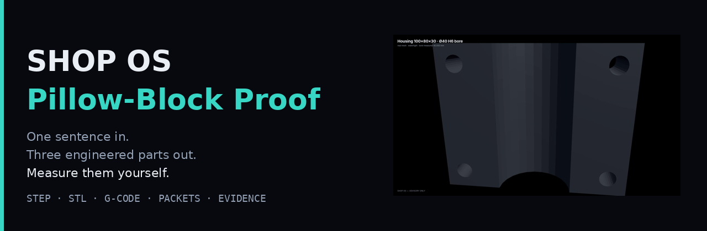
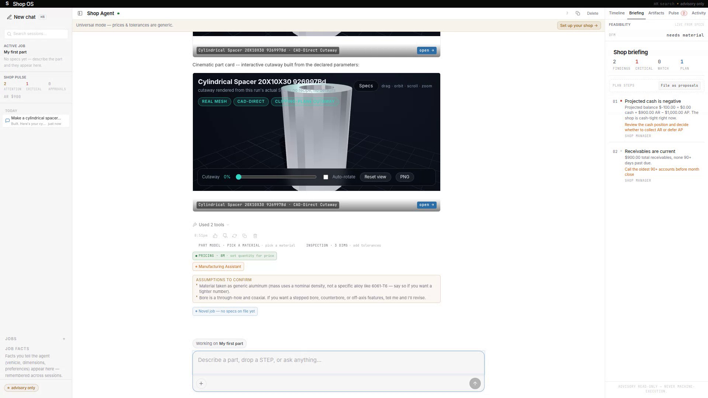
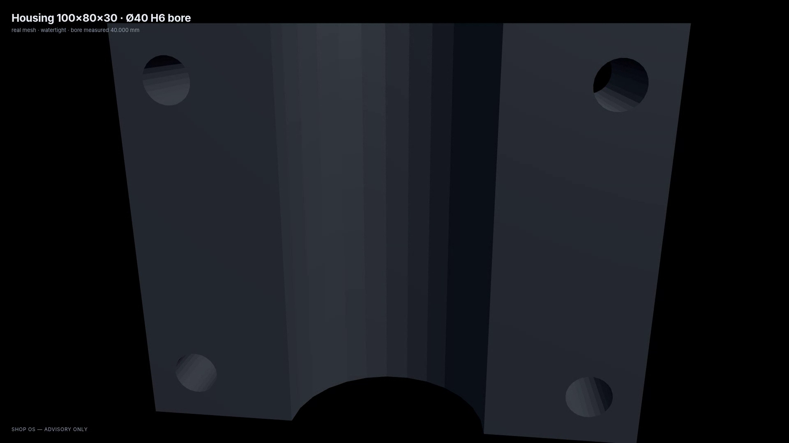
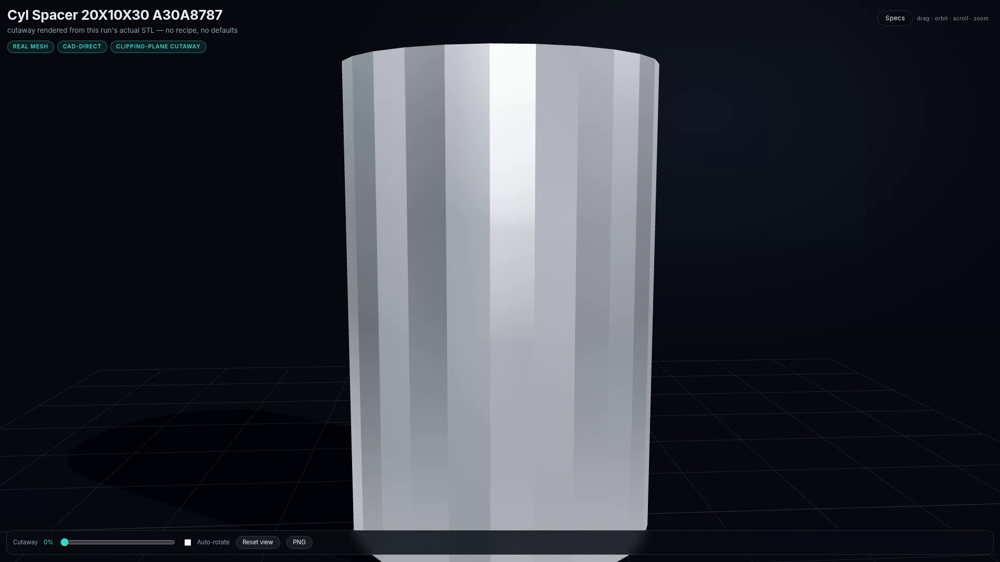

# Shop OS — Pillow-Block Proof

  

One sentence in. Three engineered parts out. **Measure them yourself.**

> Full run (28 s): one click → agent run → live interactive 3D part card in chat.
> Watch: [shopos-hero-28s.mp4](https://github.com/Foshowithit/shop-os-pillow-block-proof/releases/download/v1.0-proof/shopos-hero-28s.mp4)

> Full arc (78 s): run → housing orbit → spacer cutaway.
> Watch: [pillow-block-78s.mp4](https://github.com/Foshowithit/shop-os-pillow-block-proof/releases/download/v1.0-proof/pillow-block-78s.mp4)

> Beauty pass (30 s): orbit + cutaway.
> Watch: [shopos-card3d-30s.mp4](https://github.com/Foshowithit/shop-os-pillow-block-proof/releases/download/v1.0-proof/shopos-card3d-30s.mp4)

A shop agent takes a part description, engineers it (CAD, DFM, toolpaths,
verification), and hands you files — not renders. This repo is the receipts
from one real run: a pillow-block bearing unit (housing + cap + base plate).

## Watch

| Video | What |
|---|---|
| [shopos-hero-28s.mp4](https://github.com/Foshowithit/shop-os-pillow-block-proof/releases/download/v1.0-proof/shopos-hero-28s.mp4) | One click → agent run → live interactive 3D part card inside the chat (28 s) |
| [pillow-block-78s.mp4](https://github.com/Foshowithit/shop-os-pillow-block-proof/releases/download/v1.0-proof/pillow-block-78s.mp4) | Full arc: run → housing orbit → spacer cutaway (78 s) |
| [shopos-card3d-30s.mp4](https://github.com/Foshowithit/shop-os-pillow-block-proof/releases/download/v1.0-proof/shopos-card3d-30s.mp4) | Pure 3D: orbit + clipping-plane cutaway on the real mesh (30 s) |

## Measure it yourself

| File | Verification (independently re-measured) |
|---|---|
| `models/housing.step` / `.stl` | Open CASCADE 7.9 AP214 · 500 facets · watertight · bbox 100×80×30 · bore Ø40.000 |
| `models/cap.step` / `.stl` | 500 facets · watertight · groove Ø40.000 |
| `models/base_plate.step` / `.stl` | 876 facets · watertight · 120×100×12 |
| `programs/bore_h6_advisory.nc` | 113 blocks; parses clean; simulated — 36,224 voxels removed (1 mm grid) |
| `programs/drill_9mm.nc` | 11 blocks, 4×Ø9 pattern; simulated — 5,584 voxels removed |
| `programs/tap_m8.nc` | 14 blocks, M8×1.25 tapping w/ pitch check; simulated — 2,792 voxels removed |
| `programs/BLOCK-receipt.json` | Our own validator **refused** the naive end-mill-only Ø40 H6 plan |
| `programs/PASS-receipt.json` | Corrected bore+hone+CMM plan passes, hazard honestly still flagged |
| `packets/` | Per-part DFM packets + assembly manifest — every number reproduced; estimates labeled as estimates |

## The honest flex

Most demos show success paths. Ours shows the system catching itself: the
naive bore plan gets BLOCKed with reasons, re-simulated as proof, and only
the corrected plan ships. Independently reviewed file-by-file — verdict: legit.

> ⚠️ **ADVISORY ONLY — NOT FOR MACHINE EXECUTION.** Every program, packet,
> and receipt here is engineering output for human review. Nothing runs on a
> controller without a qualified machinist's sign-off.

MIT License — files are yours to open, measure, cut (after review), and post about.
